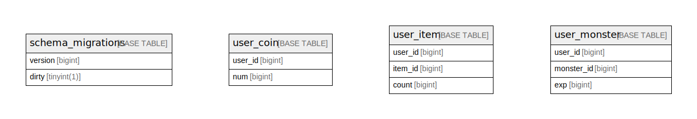

# game_server_example

## Tables

| Name | Columns | Comment | Type |
| ---- | ------- | ------- | ---- |
| [schema_migrations](schema_migrations.md) | 2 |  | BASE TABLE |
| [user_coin](user_coin.md) | 5 | ユーザコイン | BASE TABLE |
| [user_item](user_item.md) | 6 | ユーザアイテム | BASE TABLE |
| [user_monster](user_monster.md) | 6 | ユーザアイテム | BASE TABLE |

## Relations

---

> Generated by [tbls](https://github.com/k1LoW/tbls)
