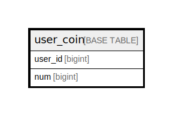

# user_coin

## Description

ユーザコイン

<details>
<summary><strong>Table Definition</strong></summary>

```sql
CREATE TABLE `user_coin` (
  `user_id` bigint NOT NULL COMMENT 'ユーザID',
  `num` bigint NOT NULL COMMENT '個数',
  `deleted_at` datetime DEFAULT NULL COMMENT '削除日時',
  `created_at` datetime NOT NULL DEFAULT '1970-01-01 00:00:00' COMMENT '作成日時',
  `updated_at` datetime NOT NULL DEFAULT '1970-01-01 00:00:00' COMMENT '更新日時',
  PRIMARY KEY (`user_id`)
) ENGINE=InnoDB DEFAULT CHARSET=utf8mb4 COLLATE=utf8mb4_0900_ai_ci COMMENT='ユーザコイン'
```

</details>

## Columns

| Name | Type | Default | Nullable | Children | Parents | Comment |
| ---- | ---- | ------- | -------- | -------- | ------- | ------- |
| user_id | bigint |  | false |  |  | ユーザID |
| num | bigint |  | false |  |  | 個数 |
| deleted_at | datetime |  | true |  |  | 削除日時 |
| created_at | datetime | 1970-01-01 00:00:00 | false |  |  | 作成日時 |
| updated_at | datetime | 1970-01-01 00:00:00 | false |  |  | 更新日時 |

## Constraints

| Name | Type | Definition |
| ---- | ---- | ---------- |
| PRIMARY | PRIMARY KEY | PRIMARY KEY (user_id) |

## Indexes

| Name | Definition |
| ---- | ---------- |
| PRIMARY | PRIMARY KEY (user_id) USING BTREE |

## Relations



---

> Generated by [tbls](https://github.com/k1LoW/tbls)
